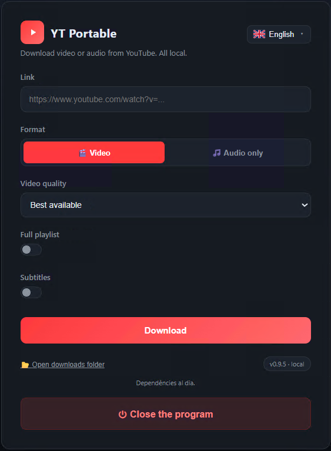

# YT Portable

A self-contained YouTube **video / audio** downloader for Windows with a local
web interface, built on top of [yt-dlp](https://github.com/yt-dlp/yt-dlp).
Paste a link, pick **video** or **audio only**, choose the quality, and download.

**No installation required.** A one-click builder assembles a fully portable
folder (embedded Python + `yt-dlp.exe` + `ffmpeg`). Nothing is written to the
system: no entries in Program Files, the registry, or PATH, and no admin rights.
You can drop the whole folder on a USB stick and run it anywhere.

> Uses only the Python standard library — no Flask, no `pip`.



---

## Features

- Clean local web UI (dark theme), opens automatically in your browser.
- **Interface available in 17 languages** (auto-detected from the browser, with
  a selector showing each language's native name and an SVG flag): Spanish,
  English, French, Portuguese, Italian, German, Russian, Chinese, Japanese,
  Korean, Hindi, Bengali, Arabic, Indonesian, Urdu, Czech, Polish — including
  RTL layout for Arabic and Urdu. (Docs are EN/ES only.)
- Video (`.mp4`, up to best available / 1080p / 720p / 480p / 360p) or
  audio-only (MP3 / M4A / Opus / WAV / FLAC).
- Optional **full playlist download** (off by default — downloads only the
  linked video), with per-item progress (e.g. `3/12`).
- Real-time progress (percentage, speed, ETA) and a **cancel** button.
- Runs **without a console window** (uses `pythonw.exe`); a big **Close** button
  in the UI stops it.
- **Self-updating dependencies**, safely: checks at most once per day, downloads
  new versions of yt-dlp/ffmpeg to a staging area, and applies them on the next
  launch (Windows can't overwrite a binary while it's in use).
- yt-dlp updates are **verified against the official SHA-256 checksum** before
  being applied; ffmpeg falls back to a second source if the primary is down.
- Automatic free-port selection and an on-screen error page if startup fails.

---

## Quick start

1. Put `app.py` and `Setup-Portable.bat` in an empty folder.
2. Double-click **`Setup-Portable.bat`** (once). It downloads, into that same
   folder: embedded Python (`runtime/`), `yt-dlp.exe`, and `ffmpeg` (`bin/`).
   This takes a few minutes (ffmpeg is large) and installs nothing system-wide.
3. It creates **`YT Portable.lnk`** — double-click it to launch (no console
   window). `Start-Portable.bat` is an equivalent fallback launcher.
4. The UI opens at `http://127.0.0.1:8765`. Downloads land in `downloads/`.

After the first build you never need the builder again. Copy the folder
anywhere and it just works (Windows 10/11; uses the built-in `curl` and
PowerShell only during the build).

---

## How auto-update works

1. **On launch**, any update staged previously is applied first (new binaries
   moved from `_staging/` into `bin/`, old ones deleted), then the app starts.
2. **In the background** (at most once a day), it checks GitHub for a newer
   yt-dlp and gyan.dev for a newer ffmpeg. If found, it downloads them to
   `_staging/`.
3. **Next launch** the staged binaries are applied.

The yt-dlp download is rejected unless its SHA-256 matches the official
`SHA2-256SUMS`. The Python interpreter (`runtime/`) is intentionally **not**
auto-updated. If there's no internet or a check fails, the app keeps running
with whatever it already has.

---

## Project structure

```
.
├── app.py                 # The whole program (server + UI), stdlib only
├── Setup-Portable.bat     # One-time builder (downloads runtime + binaries)
├── README.md
├── LEEME.md               # Spanish docs
├── LICENSE
└── .gitignore
```

After building (these are git-ignored, not committed):

```
├── runtime/               # Embedded Python (incl. pythonw.exe)
├── bin/                   # yt-dlp.exe, ffmpeg.exe, ffprobe.exe, versions.json
├── downloads/             # Your downloads
├── YT Portable.lnk        # Generated launcher
└── Start-Portable.bat
```

---

## Configuration

A few constants at the top of `app.py`:

- `PORT` — base port (default `8765`; the app probes the next 20 if it's busy).
- Output template, quality strings, and update sources are also there.

---

## Troubleshooting

- **Nothing happens / a browser error tab opens** — check `app.log` next to
  `app.py`. If another instance is already running, the app detects it
  automatically and reopens that same UI instead of starting a new one.
- **Antivirus flags `yt-dlp.exe`** — a common false positive; allow it.
- **The `.lnk` couldn't be created** — use `Start-Portable.bat` instead.
- **Updates never apply** — make sure the app was fully closed (via the Close
  button) so the staged binaries aren't locked.

---

## Licenses & dependencies

| Component | License | Notes |
|-----------|---------|-------|
| This project | MIT | See [LICENSE](LICENSE) |
| [yt-dlp](https://github.com/yt-dlp/yt-dlp) | The Unlicense | Public domain |
| [CPython](https://www.python.org/) (embedded) | PSF License | BSD-compatible, permissive |
| [FFmpeg](https://ffmpeg.org/) | GPL 2+ | See note below |

**FFmpeg and the GPL.** FFmpeg is open source but uses a copyleft license (GPL 2+): if you *distribute* a product that bundles FFmpeg, your own code must also be GPL-compatible. This project never bundles FFmpeg — the builder downloads it directly from the official source onto the user's own machine. No redistribution takes place, so the GPL's copyleft clause does not apply to you as a developer or to your users. If you fork this project and change how FFmpeg is delivered (e.g. you start shipping the binary yourself), review your GPL obligations.

## Disclaimer

This is a personal-use tool. You are responsible for complying with YouTube's
Terms of Service and the copyright laws of your jurisdiction. Download only
content you have the right to.

## License

MIT — see [LICENSE](LICENSE). (Update the copyright holder line to your name.)
